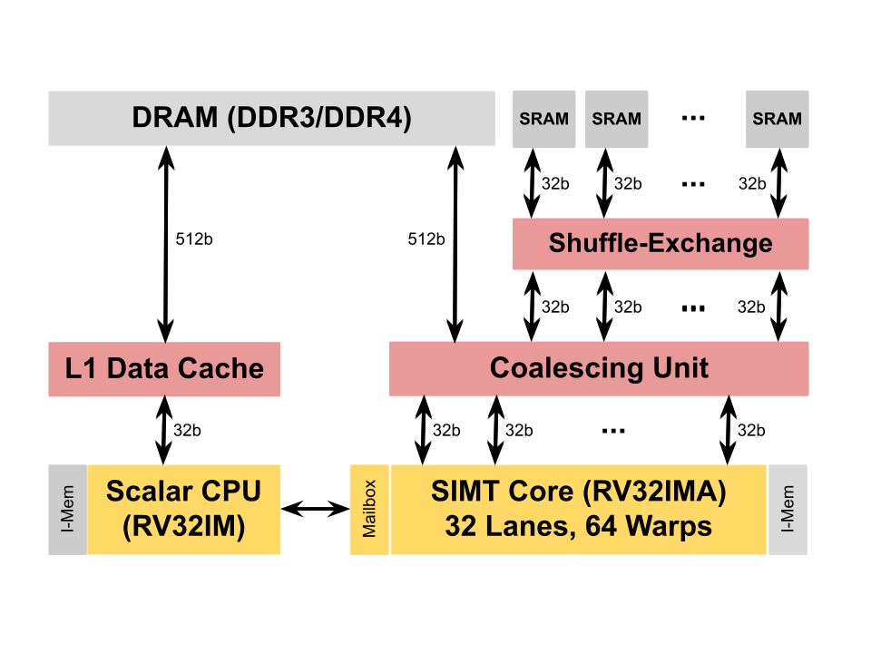

# Pebbles

Pebbles is a RISC-V processor framework supporting *plugable
pipelines*.  Different [pipeline
implementations](src/Pebbles/Pipeline) may be connected to the same
[instruction set implementation](src/Pebbles/Instructions) by way of a
common [pipeline interface](src/Pebbles/Pipeline/Interface.hs).
Pebbles is written in a modern HDL called
[Blarney](https://github.com/blarney-lang/blarney).

Currently, Pebbles supports the RV32IMA instruction set and two
pipelines:

  * A 5-stage in-order [scalar pipeline](src/Pebbles/Pipeline/Scalar.hs).

  * An 8-stage [SIMT pipeline](src/Pebbles/Pipeline/SIMT.hs)
    with a parameterisable number of warps and warp size.

A sample SoC (SIMTight) is included which contains a scalar CPU, a
data cache, a 32-lane 64-warp SIMT accelerator, a coalescing unit, and
shared DRAM.



The SoC is optimised for a high MIPS/LUT on FPGA.  A sample project is
provided for the [DE10-Pro](http://de10-pro.terasic.com) development
board.  There is also a [CUDA-like library](inc/Pebbles/NoCL.h) and a
set of sample [compute kernels](SIMTight/apps/).

## Build instructions

We'll need Verilator, the RISC-V SDK, and a fairly recent version
of GHC (8.6.1 or later).

On Ubuntu 20.04, we can simply do:

```sh
$ sudo apt install verilator
$ sudo apt install gcc-riscv64-unknown-elf
$ sudo apt install ghc-8.6.5
```

Now, we recursively clone the repo:

```sh
$ git clone --recursive https://github.com/blarney-lang/pebbles
```

Inside the repo, there are various things to try.  For example, to
build and run the SIMTight simulator:

```sh
$ cd SIMTight/sim
$ make
$ ./sim
```

While the simulator is running, you can build and run the test suite
in a separate terminal:

```sh
$ cd SIMTight/apps/TestSuite
$ make test-cpu-sim     # Run on the CPU
$ make test-simt-sim    # Run on the SIMT core
```

Alternatively, you can run one of the SIMT kernels:

```sh
$ cd SIMTight/apps/VecAdd
$ make RunSim
$ ./RunSim
```

To run all tests and benchmarks, use the test script.  This script
will launch the simulator automatically, so first make sure it's not
already running.

```sh
$ killall sim
$ cd SIMTight/test
$ ./test.sh            # Run in simulation
$ ./test.sh --fpga     # Run on FPGA (DE10-Pro)
```
