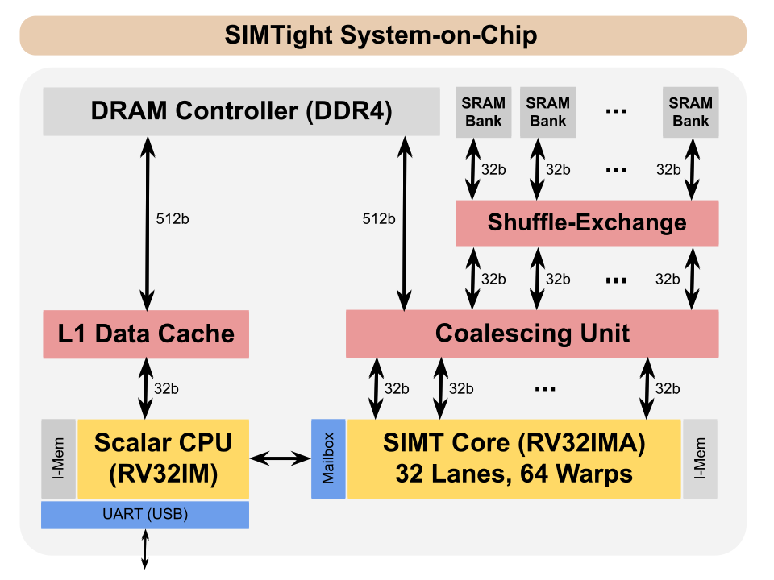

# Pebbles

Pebbles is a RISC-V processor framework supporting *plugable
pipelines*.  Different [pipeline
implementations](src/Pebbles/Pipeline) may be connected to the same
[instruction set implementation](src/Pebbles/Instructions) by way of a
common [pipeline interface](src/Pebbles/Pipeline/Interface.hs).
Pebbles is written in a modern HDL called
[Blarney](https://github.com/blarney-lang/blarney).

Currently, Pebbles supports the `RV32IMAxCHERI` instruction set and
two pipelines:

  * A 5-stage in-order [scalar pipeline](src/Pebbles/Pipeline/Scalar.hs).

  * An 8-stage [SIMT pipeline](src/Pebbles/Pipeline/SIMT.hs) (Single
    Instruction Multiple Threads) with a parameterisable number
    of warps and warp size.

## SIMTight SoC

SIMTight is an FPGA-optimised GPGPU being developed on the
[CAPcelerate
project](https://gow.epsrc.ukri.org/NGBOViewGrant.aspx?GrantRef=EP/V000381/1)
to explore the impact of [CHERI](https://cheri-cpu.org) on SIMT
(Single Instruction Multiple Threads) style accelerators popularised
by NVIDIA and AMD.  The SoC consists of a scalar CPU and a 32-lane
64-warp GPGPU sharing DRAM, both supporting the CHERI-RISC-V ISA:



The SoC is optimised for a high MIPS/LUT on FPGA.  A sample project is
provided for the [DE10-Pro](http://de10-pro.terasic.com) development
board.  There is also a [CUDA-like C++
library](soc/SIMTight/inc/NoCL.h) and a set of sample [compute
kernels](soc/SIMTight/apps/) ported to this library.

## Build instructions

We'll need Verilator, the RISC-V SDK, and a fairly recent version
of GHC (8.6.1 or later).

On Ubuntu 20.04, we can simply do:

```sh
$ sudo apt install verilator
$ sudo apt install gcc-riscv64-unknown-elf
$ sudo apt install ghc-8.6.5
```

Now, we recursively clone the repo:

```sh
$ git clone --recursive https://github.com/blarney-lang/pebbles
```

Inside the repo, there are various things to try.  For example, to
build and run the SIMTight simulator:

```sh
$ cd soc/SIMTight/sim
$ make
$ ./sim
```

While the simulator is running, you can build and run the test suite
in a separate terminal:

```sh
$ cd soc/SIMTight/apps/TestSuite
$ make test-cpu-sim     # Run on the CPU
$ make test-simt-sim    # Run on the SIMT core
```

Alternatively, you can run one of the SIMT kernels:

```sh
$ cd soc/SIMTight/apps/Histogram
$ make RunSim
$ ./RunSim
```

To run all tests and benchmarks, use the test script.  This script
will launch the simulator automatically, so first make sure it's not
already running.

```sh
$ killall sim
$ cd soc/SIMTight/test
$ ./test.sh            # Run in simulation
```

To build an FPGA image (specifially for the
[DE10-Pro](http://de10-pro.terasic.com) board):

```sh
$ cd soc/SIMTight/de10-pro
$ make                 # Assumes quartus is in your PATH
$ make download-sof    # Assumes DE10-Pro is connected via USB
```

We can now run a SIMT kernel, almost exactly how we did so via the
simulator.

```sh
$ cd soc/SIMTight/apps/Histogram
$ make Run
$ ./Run
```

To run the test suite and all benchmarks on FPGA:

```sh
$ cd soc/SIMTight/test
$ ./test.sh --fpga     # Assumes FPGA image built and FPGA connected via USB
```
