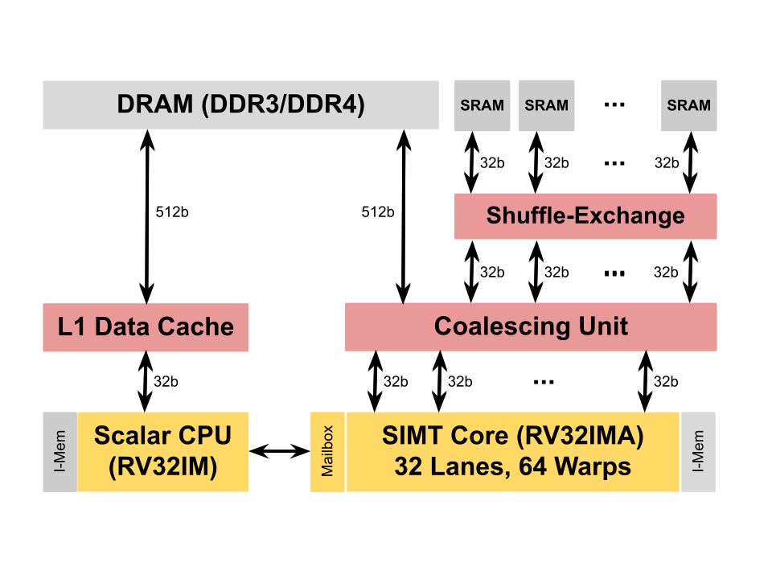

# Pebbles

Pebbles is a RISC-V processor framework supporting plugable pipelines.
The [instruction set](src/Pebbles/Instructions) and
[pipelines](src/Pebbles/Pipeline) are defined separately, allowing
different pipelines to share the same instruction set definition. 
We do this with the help of a modern HDL called
[Blarney](https://github.com/blarney-lang/blarney).

Currently, Pebbles supports the RV32IM instruction set and provides
two pipelines:

  * A standard 5-stage in-order [scalar pipeline](src/Pebbles/Pipeline/Scalar.hs).

  * A 9-stage [SIMT pipeline](src/Pebbles/Pipeline/SIMT.hs)
    with a parameterisable number of warps and warp size.

A sample SoC is included which by default contains a scalar CPU, a
data cache, a 32-lane 64-warp SIMT accelerator, a coalescing unit, and
shared DRAM.



The SoC is optimised for a high MIPS/LUT on FPGA.  It clocks over
200MHz on a Stratix V and uses under 40K ALMs.  We also have the
beginnings of a basic CUDA-like library for writing accelerator
kernels. All this is work in progress; it's functional but
currently limited in terms of features.

## Build instructions

We'll need Verilator, the RISC-V SDK, and a fairly recent version
of GHC (8.6.1 or later).

On Ubuntu 20.04, we can simply do:

```sh
$ sudo apt install verilator
$ sudo apt install gcc-riscv64-unknown-elf
$ sudo apt install ghc-8.6.5
```

Now, we recursively clone the repo:

```sh
$ git clone --recursive https://github.com/blarney-lang/pebbles
```

Inside the repo, there are various things to try.  For example, to
build and run the SoC simulator:

```sh
$ cd sim
$ make
$ ./sim
```

While the simulator is running, you can build and run the test suite
in a separate terminal:

```sh
$ cd apps/TestSuite
$ make test-cpu-sim     # Run the RISC-V test suite on the CPU
$ make test-simt-sim    # Run the RISC-V test suite on the SIMT core
```

Alternatively, you can run one of the SIMT kernels:

```sh
$ cd apps/VectorAdd
$ make RunSim
$ ./RunSim
```
